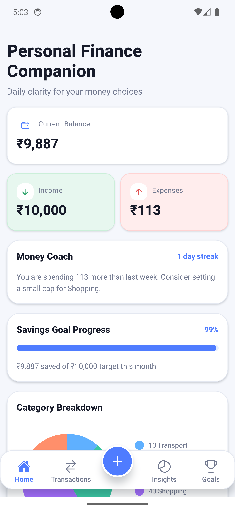
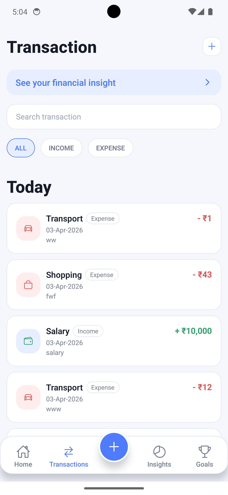
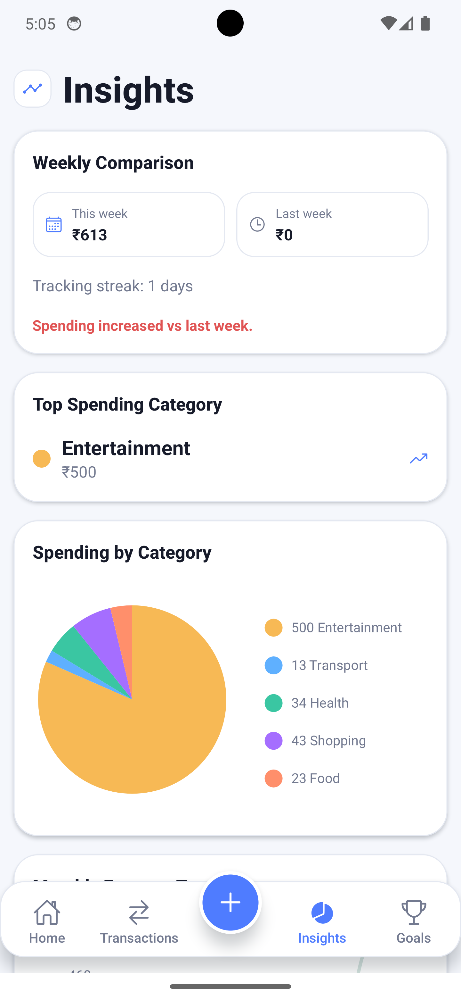
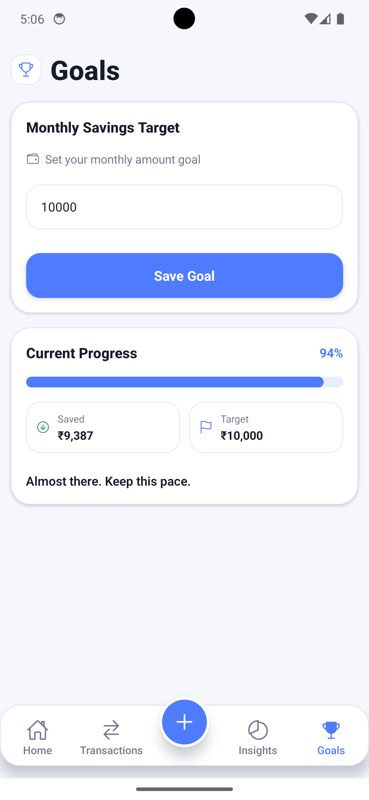

# Personal Finance Companion (React Native + Expo)

Mobile-first personal finance app to track money flow, visualize spending, and stay aligned with savings goals.

## Screenshots

| Home | Transactions |
|---|---|
|  |  |

| Insights | Goals |
|---|---|
|  |  |

## Overview

The app helps users:
- Track income and expense transactions
- Search and filter transaction history
- Edit and delete existing entries
- Set and monitor monthly savings goals
- View category and trend-based insights
- Get contextual coaching via streak and spending signals

## Tech Stack

- React Native (Expo)
- JavaScript
- React Navigation (Bottom Tabs + Native Stack)
- Zustand + AsyncStorage persistence
- react-native-chart-kit
- @react-native-community/datetimepicker

## Setup

### Prerequisites

- Node.js (LTS)
- npm

### Install

```bash
npm install
```

### Run

```bash
npx expo start
```

Open with:
- Android emulator / device
- iOS simulator / device
- Expo Go
- Web (`w` in Expo terminal)

## Scripts

```bash
npm run start
npm run android
npm run ios
npm run web
```

## Build Notes (EAS)

Useful commands:

```bash
eas build -p android --profile preview-android
eas build -p ios --profile preview-ios-simulator
```

### Latest Preview Build (Android)

- APK download: https://expo.dev/artifacts/eas/i9ZChYQ7d8H8g52WCfn8qF.apk
- Build logs: https://expo.dev/accounts/pawan1-tech/projects/ExoTra/builds/8aecd20c-6dbf-47c3-aa93-e8fdc6aba23b

Scan this QR code on your Android phone to download/install preview APK:


## Current Features

### Home
- Balance summary
- Income and expense cards
- Savings progress
- Category breakdown chart
- Weekly trend chart
- Coach message + tracking streak

### Transactions
- Add / edit / delete transactions
- Search and type filters (`all`, `income`, `expense`)
- Grouped list by `Today`, `Yesterday`, and older dates
- Quick access banner to insights
- Center floating add button in bottom navigation for fast entry

### Add / Edit Transaction
- Fields: amount, type, category, date, notes
- Inline validation
- Native date picker (calendar) instead of manual date typing
- Quick date shortcuts (`Today`, `Yesterday`)
- In-screen back action for accidental entry recovery

### Goals
- Monthly target setting
- Real-time progress bar
- Saved vs target visual chips
- Motivation messaging based on progress

### Insights
- Weekly comparison (this week vs last week)
- Highest spending category
- Category spending chart
- Monthly expense trend chart
- Enhanced visual cards and icons

## UX and Design

- Responsive layout with capped content width on larger screens
- Safe area-aware spacing
- Dark mode support (system-aware)
- Refined iconography and card shapes inspired by modern fintech UI
- Floating center add button in tab bar

## Data and State

- Local-first storage via AsyncStorage
- Persisted global store with Zustand
- Hydration-aware UI with loading/error fallbacks
- No backend required for core usage

## Project Structure

```text
src/
  components/      Reusable UI building blocks
  constants/       Theme, spacing, categories
  navigation/      Bottom tabs and stack flow
  screens/         Home, Transactions, Add/Edit, Insights, Goals
  services/        Persistence/storage layer
  store/           Zustand state + actions
  utils/           Finance, date, formatter helpers
```

## Assumptions

- Currency default is INR.
- Single-user local usage.
- Insights are computed only from locally stored transactions.

## Known Limitations

- No cloud sync / account login
- No recurring transaction automation
- No push notifications yet
- No CSV import/export yet

## Future Enhancements

- Recurring transaction templates
- Budget limits per category
- Export/import utilities
- Cloud sync + auth
